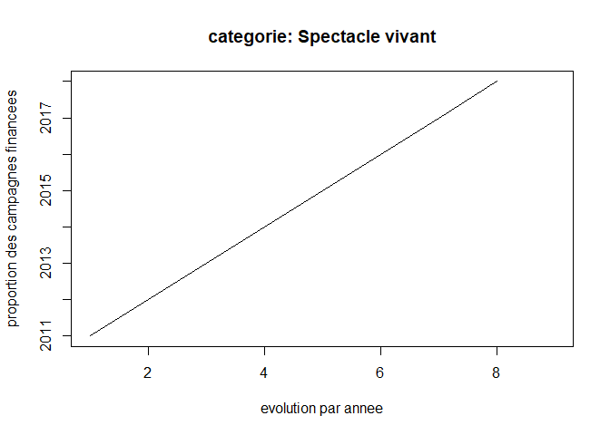

readme
================
Modou
22 avril 2020

``` r
setwd("~/MSS/projet d'expertise/projet1/ndiayemodou")
Donnees<-read.csv("data_ulule_2019-1.csv",header = TRUE,sep = ";")


library(readr)
library(dplyr)
```

    ## 
    ## Attaching package: 'dplyr'

    ## The following objects are masked from 'package:stats':
    ## 
    ##     filter, lag

    ## The following objects are masked from 'package:base':
    ## 
    ##     intersect, setdiff, setequal, union

``` r
library(ggplot2)
library(lubridate)
```

    ## 
    ## Attaching package: 'lubridate'

    ## The following object is masked from 'package:base':
    ## 
    ##     date

``` r
attach(Donnees)
```

``` r
data<-Donnees[order(country),] %>%
  filter(is_cancelled==FALSE)


  


"compter pour chaque pays le nombre de campagne
data_3<-data %>%
  count(country) %>%
  group_by(country) %>%
  arrange(desc(n)) "
```

    ## [1] "compter pour chaque pays le nombre de campagne\ndata_3<-data %>%\n  count(country) %>%\n  group_by(country) %>%\n  arrange(desc(n)) "

``` r
data_2 <- subset(data, country == "FR" | country=="BE" | country=="IT" | country=="CA" | country=="ES" | country=="CH" | country=="DE" | country=="GB")
```

``` r
data_3<-data_2 %>% 
  select(c(3,7,14))

data_4 <-data_2[,-c(3,7,14)]


taux_change <- 0.9

n<-nrow(data_3)

for (i in 1:n) {

  if(data_3$currency[i] != "EUR")
  {
    data_3$amount_raised[i] <- data_3$amount_raised[i] * taux_change
    data_3$goal[i] <- data_3$goal[i] * taux_change
    data_3$currency[i] <- "EUR"
  }
  
}

data_final <- cbind(data_4,data_3)


#changer le format des dates
data_final$date_end<-as.POSIXct(data_final$date_end)

data_final$date_start<-as.POSIXct(data_final$date_start)

data_final<- data_final %>%
  filter(data_final$date_end < ymd("2018-12-31"))


#plot(table(year(data_final$date_start)))


  
data_final["annee"] = year(data_final$date_start)


data_final['count'] = 1 


count = data_final %>% 
  filter(!is.na(data_final$category))%>% 
group_by(`annee`, `category`) %>% 
  summarise(count=  sum(count))


proportion = data_final %>% 
  filter(!is.na(data_final$category))%>% 
group_by(`annee`, `category`) %>% 
  summarise(prop=  sum(`goal_raised`)/sum(count))

moyenne = data_final %>% 
  filter(data_final$goal_raised=="TRUE" & !is.na(data_final$category))%>% 
group_by(`annee`, `category`) %>% 
  summarise(moyenne=mean(`amount_raised`, na.rm = TRUE))

donnee<-merge(proportion,moyenne, by=c("annee","category"), all=TRUE)
donnee <- merge(donnee,count,by=c("annee","category"), all=TRUE)


#data_final["mm/yyyy"] = paste(month(data_final$date_start),year(data_final$date_start), sep = "-")
```

``` r
plot(as.integer( donnee[donnee$category=="Autres projets", "annee"]), donnee[donnee$category=="Autres projets", "count"],main="categorie: Autres projet",xlab="evolution par annee", ylab="nombre total de campagne financees",type = "l")
```


``` r
plot(as.integer( donnee[donnee$category=="Musique", "annee"]), donnee[donnee$category=="Musique", "moyenne"],main="categorie: Musique",xlab="evolution par annee", ylab="moyenne des campagnes financees",type = "l")
```


``` r
plot(as.integer( donnee[donnee$category=="Film et vidéo", "annee"]), donnee[donnee$category=="Film et vidéo", "proportion"],main="categorie: Art & Photo",xlab="evolution par annee", ylab="proportion des campagnes financees",type = "l")
```



Application shiny
=================

Voici le lien pour acceder a l'application : <https://modou-abdoulaye44.shinyapps.io/ndiayemodou/>
